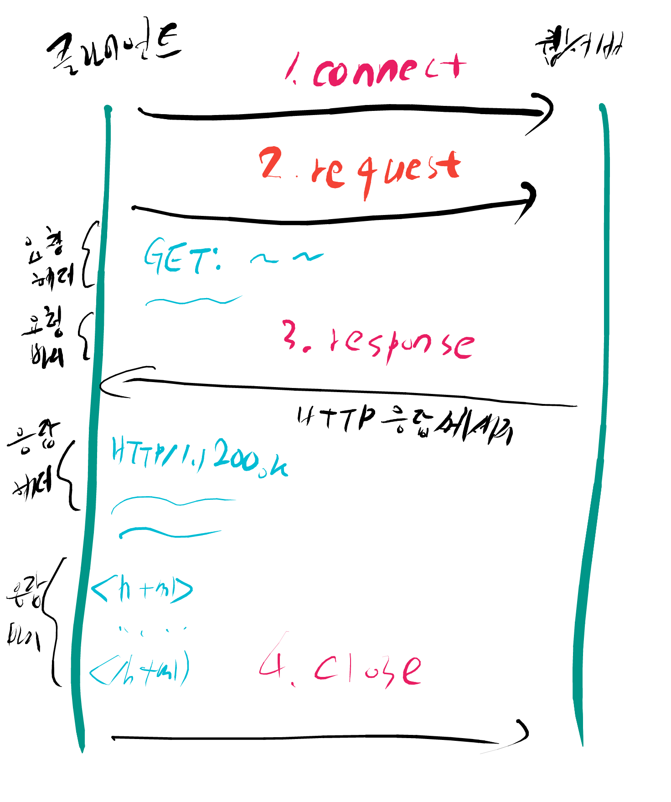

# 1. 야! 프런트엔드랑 백엔드 차이가 뭔진 알어?

Front-end:Body 
Back-end:Brain

유저가 사용하는 부분은 프론트엔드, 데이터는 백엔

# 2. html 구조 설명 (HTML Structure)

    <name attribute="value">contents</name>
    
# 3. html css javascript 차이가 무엇인고 

HTML : 브라우저한테 웹사이트 상의 요소들이 각각 무엇인지 알려주는 것 
CSS : html이 설계한 것들을 디자인 
javascript : 이벤트, 버튼 관련된 것들.

# 4. 왕초보를 위한 AWS RDS, EC2, S3

RDS : PostgreSQL database (relational databases) 서비스

EC2 : 24/7 텅빈 컴퓨터? -> 어떤 컴퓨터가 될지 선택할 수 있음 {서버(인스턴스)를 생성하기 위한 것}

S3 : 데이터를 저장하는 곳 (버켓)

elastic beanstalk : 어플리케이션을 배고하고, 클라우드에 푸쉬하는 것을 쉽게 할 수 있게 도와줌

# 5. 웹 프로그래밍을 위한 프로그램 언어들

저급 언어 : 기계 중심의 언어, 기계어 (어셈블리어 등)

고급 언어 : 사람 중심의 언어

## 웹 관련 인기 언어

- Python : 읽기 쉽고 적은 코드를 사용하여 프로그램을 개발할 수 있음. 데이터 과학에서도 자주 사용되며 웹사이트 개발에서도 많이 사용됨
- PHP : 웹의 80% 이상이 PHP로 만들어짐
- Javascript : 프론트 개발자라면 반드시 알아야할 언어. 서버까지도 영역을 넓히고 있음
- JAVA : 엔터프라이즈 소프트웨어 환경에 잘 맞는 언어
- Ruby : 빠른 개발에 널리 사용되며, 단순함과 세련된 웹 어플리케이션을 만들 수 있기 때문에 인기 있는 언어 중의 하나임.

# 6. 웹의 동작 (HTTP 프로토콜 이해)

HTTP (Hypertext Transfer Protocol) : 서버와 클라이언트가 인터넷상에서 데이터를 주고받기 위한 프로토콜(protocol). 현재 HTTP/2 버전이 등장함

## HTTP 작동방식

- HTTP는 서버/클라이언트 모델을 따름
- 장점 
    - 불특정 다수를 대상으로 하는 서비스에는 적합함
    - 클라이언트와 서버가 계속 연결된 형태가 아니기 때문에 클라이언트와 서버 간의 최대 연결 수 보다 훨씬 많은 요청과 응답을 처리할 수 있음
- 단점
    - 연결을 끓어버리기 때문에, 클라이언트의 이전 상황을 알 수가 없다.
    - 이러한 특징을 무상태(Stateless)라고 함
    - 이러한 특징 때문에 정보를 유지하기 위해서 Cookie와 같은 기술이 등장하게 되었음.
    
## URL (Uniform Resource Locator)

- 인터넷 상의 자원의 위치
- 특정 웹 서버의 특정 파일에 접근하기 위한 경로 혹은 주소

요청 메서드 : GET, PUT, POST, PUSH, OPTIONS 등의 요청 방식이 옴 
요청 URL : 요청하는 자원의 위치를 명시함 
HTTP 프로토콜 버전 : 웹 브라우저가 사용하는 프로토콜 버전

요청메소드는 서버에게 요청의 종류를 알려주기 위해서 사용됨

- GET : 정보를 요청하기 위해서 사용함. (SELECT)
- POST : 정보를 밀어넣기 위해서 사용함. (INSERT)
- PUT : 정보를 업데이트하기 위해서 사용함. (UPDATE)
- DELETE : 정보를 삭제하기 위해서 사용함. (DELETE)
- HEAD : (HTTP)헤더 정보만 요청함. 해당 자원이 존재하는지 혹은 서버에 문제가 없는지를 확인하기 위해서 사용함
- OPTIONS : 웹서버가 지원하는 메서드의 종류를 요청함.
- TRACE : 클라이언트의 요청을 그대로 반홤함. 