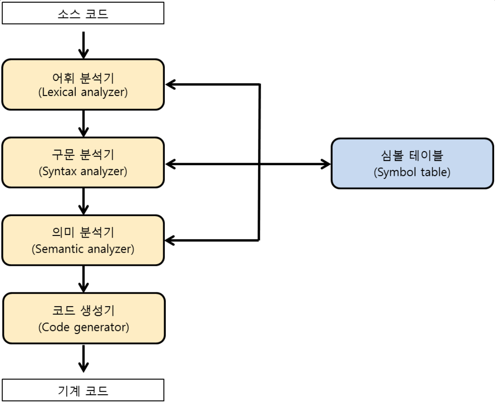

# 웹 프로그래밍을 위한 프로그램 언어들

## 목차

* 저급언어
* 고급언어
* 간단하게 알아본 일반적인 컴파일러의 구조

## 저급언어

저급 언어는 _기계 중심의 언어_ 라고 할 수 있습니다.

여기서 말하는 **기계어**란?

> 2 진수로 이뤄진 값으로 작성하는 프로그래밍 언어

라고 할 수 있습니다.

2 진수란 0 과 1 로 표현되는 숫자를 말합니다.

기계어에서의 2 진수는 꺼졌다는 0, 켜졌다는 1 로 사용됩니다.

하지만 기계어는 완전한 저급 언어이고 사람이 직접 사용하는데 굉장한 어려움이 있어 기호를 사용하여 프로그래밍을 하는 언어인 **어셈블리어(Assembly Language)**를 개발하였습니다.

하지만 컴퓨터는 사람의 기호를 바로 알아들을 수 없기 때문에 기호를 2 진수즉 기계어로 바꿔야하는 과정이 추가됩니다. 이 과정에서 사용되는 도구도 추가가 되었는데 이를 보고 **컴파일러(Compiler)** 라고 말합니다.

### 기계어와 어셈블리어의 장점

* 속도가 매우 빠르다
* 특수한 프로그래밍을 할 수 있다
* 불필요한 코드를 제외하여 최적화된 코드를 작성할 수 있다.

### 기계어와 어셈블리어의 단점

* 생산성이 매우 낮다
* 디버깅이 끔찍하다
* 코드를 이해하기도 어려우며 수정하기도 어렵다
* 사용하는곳이 매우적다.

## 고급언어

고급 언어는 _사람 중심의 언어_ 라고 할 수 있습니다.

우리가 사용하는 언어인 한글, 영어, 중국어 등등의 언어로 프로그래밍을 할 수 있는 고급진 언어입니다.

고급 언어도 앞서말한 어셈블리어와 같이 우리의 언어를 기계어로 바꾸어주는 컴파일러가 존재하게 됩니다.

종류는 여러가지가 있습니다.

예에에에에에전부터 사용했던 언어를 굳이 알아야 할 필요성은 없다고 느껴서 현재 웹 프로그래밍에서 주로 사용하고 있는 언어를 짧게 정리해봤습니다.

### 웹 프로그래밍에서 주로 사용되는 언어

* HTML: Hyper Text Markup Language 의 약자로써 월드와이드웹 문서를 작성하는 Markup Language 입니다.
* Javascript: 자바스크립트(JavaScript)는 웹을 위한 인터프리터 언어(Backend)이자 스크립트 언어(Frontend)입니다. 이번에 공부하게될 리엑트에서 주로 사용하게 될 언어입니다.
* Typescript: 자바스크립트를 확장한 언어로, JS 언어의 특성을 침범하지 않고 최신 ECMA 표준을 지원하며 JS 언어에 타입을 추가한 언어입니다. 최근들어 리엑트에서도 많이 사용합니다.
* Python: 플랫폼이 독립적이며 인터프리터식, 객체지향적, 동적 타이핑(dynamically typed) 대화형 언어입니다. 주로 Backend 와 머신러닝 계열에서 많이 사용하고 있습니다.

## 간단하게 알아본 일반적인 컴파일러의 구조

**컴파일러**란?

> 사람의 언어로 작성된 코드를 기계어의 형태로 번역하는 시스템 소프트웨어

**컴파일러의 구조**

1.  어휘 분석: 분석 단계에서 검출되는 의미 있는 조각인 어휘항목을 참조하여 토큰을 생성한다.
2.  구문 분석: 토큰 간의 관계가 올바르게 생성되었는지를 검사
3.  의미 분석: 의미적으로 올바르지 않은 코드의 존재 유무를 검사
4.  코드 생성: 소스 코드를 어셈블리어나 기계어로 변환하는 단계

### 참고

* [컴파일러의 구조](http://untitledtblog.tistory.com/9)
