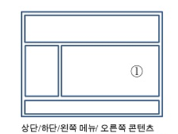
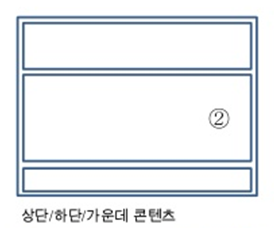
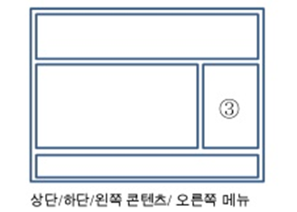
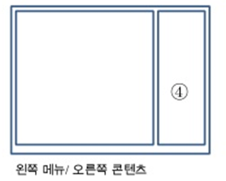

# HTML 구조설계

- 1번 형태 구조가 가장 일반적이며 많이 사용됨 

 
- 2번 형태 일반 기업 사이트의 프론트(front)페이지 설계됨 
   서브 페이지는 1번 형태로 구성됨.
   
  
- 3번 형태 개인 블로그로 많이 사용됨
  
  
- 4번 형태 사용자 설명서나 이북 형태로 콘텐츠를 제공하는 경우 사용됨.
  

# html5 적용한 html 문서 구조 잡기 
 ## 장점: 다른 프로그램에서도 호환성 유지 가능 

1번형태 소스코드 예제 

    <!DOCTYPE HTML>
    <HTML>
    <HEAD> <!-- 문서의 머리말이 들어가는 부분 -->
    <META charset="utf-8">
    <TITLE>HTML5 문서 구조 잡기 </TITLE>
    </HEAD>
    <BODY>
    <HEADER> 머리말 </HEADER>
    
 사이드메뉴 

    <!--  <aside> 사이드메뉴 </aside> 로 변경 가능 -->
    <article>본문</article> <!-- 본문-->
    <footer>꼬리말</footer>
    </body>
    </html>
! [예제](./img/temp.png)
