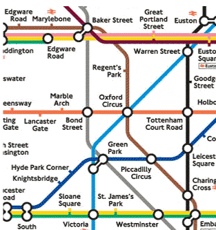
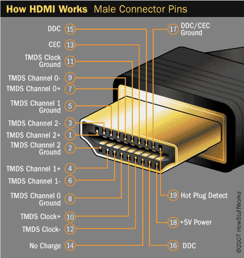

# 객체지향프로그래밍

객체지향 프로그래밍(Object-Oriented Programming)은 좀 더 나은 프로그램을 만들기 위한 프로그래밍 패러다임으로 로직을 상태(state)와 행위(behave)로 이루어진 객체로 만드는 것이다.

객체는 변수와 메소드를 그룹핑한 것이다.

객체지향 프로그래밍 교육은 크게 두 가지로 구분된다.(문법, 설계)

설계는 현실을 소프트웨어로 바꾸는 것

### 추상화

 -> 추상화 -> 

추상화란 반영해야할 현실을 소프트웨어적으로 단순화 시키는 것

### 부품화

객체 지향은 부품화의 정점이라고 할 수 있다. 메소드는 부품화의 예라고 할 수 있다. 메소드를 사용하는 기본 취지는 연관되어 있는 로직들을 결합해서 메소드라는 완제품을 만드는 것이다. 그리고 이 메소드들을 부품으로 해서 하나의 완제품인 독립된 프로그램을 만드는 것이다. 메소드를 사용하면 코드의 양을 극적으로 줄일 수 있고, 메소드 별로 기능이 분류되어 있기 때문에 필요한 코드를 찾기도 쉽고 문제의 진단도 빨라진다.

이것의 핵심은 연관된 메소드와 그 메소드가 사용하는 변수들을 분류하고 그룹핑하는 것이다. 바로 그렇게 그룹핑 한 대상이 객체(Object)다. 비유하자면 파일과 디렉토리가 있을 때 메소드나 변수가 파일이라면 이 파일을 그룹핑하는 디렉토리가 객체라고 할 수 있다.

### 은닉화, 캡슐화

모니터가 어떻게 동작하는지 몰라도 컴퓨터와 모니터를 연결하는 방법만 알면 화면을 표시 할 수 있는 것과 같은 이치다. 즉 내부의 동작 방법을 단단한 케이스 안으로 숨기고 사용자에게는 그 부품의 사용방법만을 노출하고 있는 것이다. 이러한 컨셉을 정보의 은닉화(Information Hiding), 또는 캡슐화(Encapsulation)라고 부른다

### 인터페이스

 각각의 부품은 미리 정해진 약속에 따라서 신호를 입, 출력하고, 연결점의 모양을 표준에 맞게 만들면 된다. 이러한 연결점을 인터페이스(interface)라고 한다.인터페이스란 이질적인 것들이 결합하는 것을 막아주는 역할도 하는 것이다. 즉 인터페이스는 부품들 간의 약속이다. (하드웨어 측면에서)

# 생성자와_new

객체란 서로 연관된 변수와 함수를 그룹핑한 그릇이라고 할 수 있다. 객체 내의 변수를 프로퍼티(property) 함수를 메소드(method)라고 부른다. 객체를 만들어보자.

~~~javascript
var person = {}                     // person 객체생성
person.name = 'egoing';             // name변수에 'egoing'을 넣음
person.introduce = function(){      // intoduce 메서드 정의
    return 'My name is '+this.name; // this는 객체 자신을 말함
}
document.write(person.introduce()); // 출력
~~~
위는 객체생성방법이다
~~~javascript
var person = {
    'name' : 'egoing',
    'introduce' : function(){
        return 'My name is '+this.name;
    }
}
document.write(person.introduce());
~~~
위처럼 {}안에 변수, 메서드를 설정할 수 있다.

### 생성자

생성자(constructor)는 객체를 만드는 역할을 하는 함수다. 자바스크립트에서 함수는 재사용 가능한 로직의 묶음이 아니라 객체를 만드는 창조자라고 할 수 있다. JAVA같은경우 생성자는 Class안에 정의가 되어있어야 하는데 javascript에서는 Class정의가 따로 필요없다

~~~javascript
function Person(){}             //  생성자를 정의, 현재는 그냥 아무것도 없음
var p0 = Person();              //  new가 없기때문에 그냥 Person이라는 메서드를 호출
var p = new Person();           //  new가 있으면 객체생성을 의미
p.name = 'egoing';              //  생성한 객체에 멤버변수 name을 지정
p.introduce = function(){       //  생성한 객체에 introduce라는 메서드를 정의
    return 'My name is '+this.name; 
}
document.write(p.introduce());
~~~

함수를 호출할 때 new을 붙이면 새로운 객체를 만든 후에 이를 리턴한다. 위의 코드는 새로운 객체를 변수 p에 담았다. 여러사람을 위한 객체를 만든다면 아래와 같이 코드를 작성해야 할 것이다. 

~~~javascript
function Person(name){                // 생성자 정의이다. 인자값으로 name을 필요
    this.name = name;                 // 생성되는 객체의 멤버변수 name을 인자값을 들어온 name으로 넣는다.
    this.introduce = function(){      // 메서드 introduce정의
        return 'My name is '+this.name; 
    }   
}
var p1 = new Person('egoing');
document.write(p1.introduce()+" ");
 
var p2 = new Person('leezche');
document.write(p2.introduce());
~~~

생성자 내에서 이 객체의 프로퍼티를 정의하고 있다. 이러한 작업을 초기화라고 한다. 이를 통해서 코드의 재사용성이 대폭 높아졌다.

코드를 통해서 알 수 있듯이 생성자 함수는 일반함수와 구분하기 위해서 첫글자를 대문자로 표시한다.

### 자바스크립트 생성자의 특징

일반적인 객체지향 언어에서 생성자는 클래스의 소속이다. 하지만 자바스크립트에서 객체를 만드는 주체는 함수다. 함수에 new를 붙이는 것을 통해서 객체를 만들 수 있다는 점은 자바스크립트에서 함수의 위상을 암시하는 단서이면서 또 자바스크립트가 추구하는 자유로움을 보여주는 사례라고 할 수 있다.