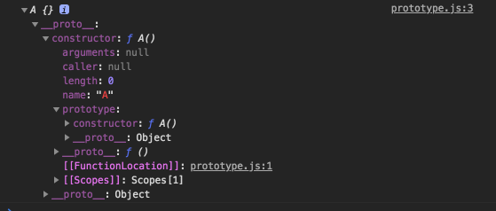

# prototype
> 자바스크립트에서 모든 객체는 자신을 생성한 모든 원형의 객체의 원형에 대한 숨겨진 연결을 갖는다. 이때 자기 자신을 생성하기 위해 사용된 객체원형을 프로토타입이라고 한다. <br/>
자바스크립트의 모든 객체는 Object 객체의 프로토타입을 기반으로 확장 된 것이기 때문에 이 연결의 끝은 Object 객체의 프로토타입 Object이다.

자바나 다른 클래스 기반 언어에서의 class가 바로 자바스크립트의 프로토 타입과 비슷한 의미일 것 같다. 

```javascript
function A() {}
var a = new A()
console.log(a);
```
위 코드는 `new`라는 키워드를 이용하여 새로운 객체를 생성하고 a라는 변수에 할당하는 코드이다. 그렇게 만들어진 객체에 `console.log`를 이용해 출력해 보면 아래와 같다. 


주의 깊게 살펴 볼 것은 `__proto__`와 `constructor`이다. `__proto__`는 A라는 객체를 만들어 내기 위해 사용된 객체의 원형에 연결된 속성이다. 해당 객체의 프로토타입은 A라는 함수 객체이며 이 객체의 생성자 역시 `function A()`라는 함수라는 뜻이다. 즉 `new` 키워드를 이용해 만들어진 객체는 생성자 함수를 자신의 프로토타입으로 사용하여 만들어 졌다는 것이다. 

# 생성자의 문제점 

인스턴스 공통의 메소드를 정의하려면 적어도 생성자로 메소드를 정의할 필요가 있다. 그러나 생성자 함수에 의한 메서드 추가에는 메서드 수에 비례하여 쓸데 없는 메모리 소비가 문제점이다. 생성자는 각각의 인스턴스를 생성할 때마다 메모리를 확보하는데 아래의 클래스에 속하는 속성과 메소드를 복사한다는 뜻이다. 
```javascript
function Member(firstName, lastName) {
    this.firstName = firstName;
    this.lastName = lastName;
    this.getName = function () {
        return `${this.lastName} 으로 불러여`
    }
}

var member1 = new Member('lee', 'changho')
```
각각의 인스턴스에 사용되는 메소드들이 다 다르고 복잡한 메소드를 10, 20개를 갖는 클래스라고 한다면 상당한 메모리 낭비라고 할 수 있다. 

# prototype 프로퍼티

그래서 자바스크립트에선 객체에 메소드를 추가하기 위한 prototype이라고 하는 속성을 가지고 있다. prototype 속성은 빈 객체를 참조하고 있는데 이것에 프로퍼티나 메소드를 추가 할 수 있다. 
그리고 이 prototype 속성에 대입된 메서드나 속성은 인스턴스화된 객체에 상속된다. 
```javascript
function Memeber (firstName, lastName) {
    this.firstName = firstName;
    this.lastName = lastName;
};
Member.prototype.getName = function() {
    return `${this.lastName}이라고 불러 주세여`
}

var member2 = new Member('kim', 'jisuk');
console.log(member2.getName()) // jisuk이라고 불러 주세여
```

프로토타입 객체(`prototype`속성이 참조하는 객체)에 추가된 메소드가 Member 클래스의 인스턴스(member2)에서도 잘 참조하면서 작동하고 있다. 

# 프로토타입 객체를 사용한 메소드 정의 두가지 
1. 메모리 사용량을 절감
 - 프로토타입 객체의 내용은 어디까지나 베이스 객체로부터 참조만 될 뿐 인스턴스에 그대로 복사 되는 것이 아니다. 
2. 메소드 추가나 변경을 인스턴스가 실시간으로 인식 가능
 - 인스턴스에 메서드를 복사하지 않는다라고 하는 것은 프로토타입 객체로의 변경을 인스턴스에서 동적으로 인식 할 수 있다는 의미이다. 
```javascript
function Member (firstName, lastName) {
    this.firstName = firstName;
    this.lastName = lastName;
};

var member2 = new Member('kim', 'jisuk'); // 인스턴스를 먼저 생성
Member.prototype.getName = function() { // 메서드 추가
    return `${this.lastName} ${this.firstName}이라고 불러 주세여`
}
console.log(member2.getName()) // jisuk이라고 불러 주세여
```

# prototype chain

객체 지향 언어를 이해 하는데 있어 중요한 개념이 상속이다. 상속이란 베이스가 되는 객체(클래스)의 기능을 새로운 클래스가 말 그대로 상속받아 새로운 클래스에서 다시 사용하는 것을 말한다. 

이 기능을 이용하면 공통된 기능을 복수의 클래스에서 중복 정의할 필요가 없어지고 근원이 되는 클래스로부터의 기능만을 정의하는 것으로 끝나게 된다. 

자바스크립트에서는 이런 상속구조를 _프로토타입체인_이라고 한다. 
```javascript
function Animal () {}; // 동물 수퍼 클래스 정의
Animal.prototype = {
    walk: function() {
        console.log('걷는다');
    }
}

var Dog = function() {
    console.log(this) // Dog{}
    Animal.call(this); // Animal 생성자를 현재의 this로 호출하라는 의미
}

Dog.prototype = new Animal()

var d = new Dog();
d.walk() // 걷는다
```
Animal 객쳉서 walk 메소드가 찾아지므로 검색은 종료되지만 발견되지 않는 경우에는 한층 더 위의 프로토타입(최상위의 Object.prototype까지)으로 거슬러 올라가게 된다. 이것 처럼 프로토타입에 인스턴스를 설정함으로서 인스턴스끼리 참조 하에 서로 연결되어 상속 관계를 할 수 있다. 이런 프로토타입의 연결을 프로토타입 체인이라고 한다. 